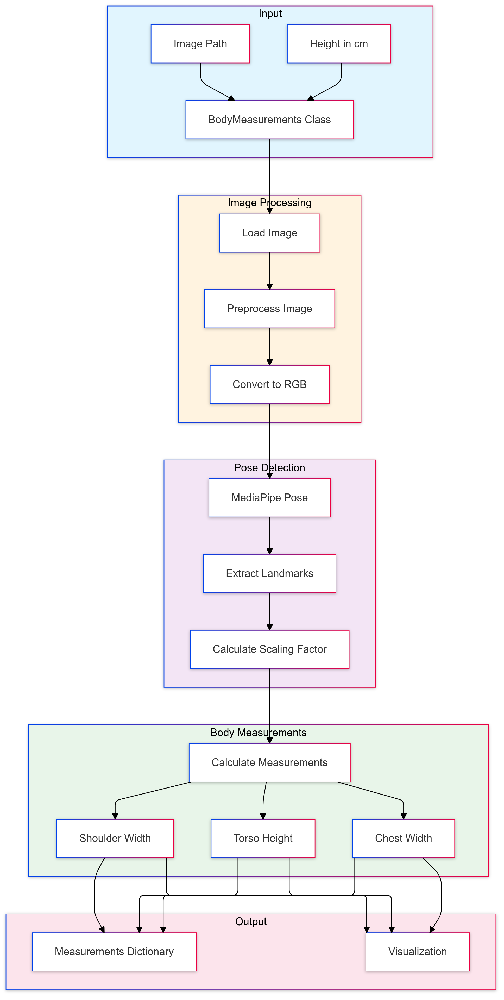
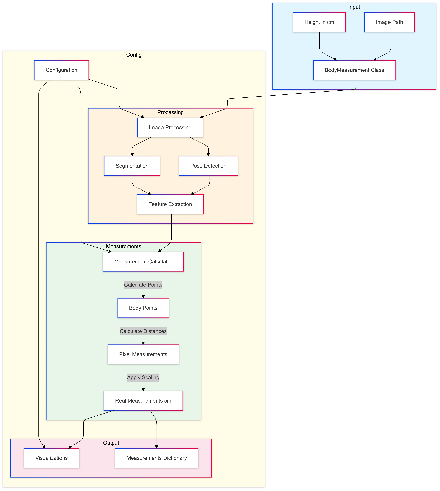
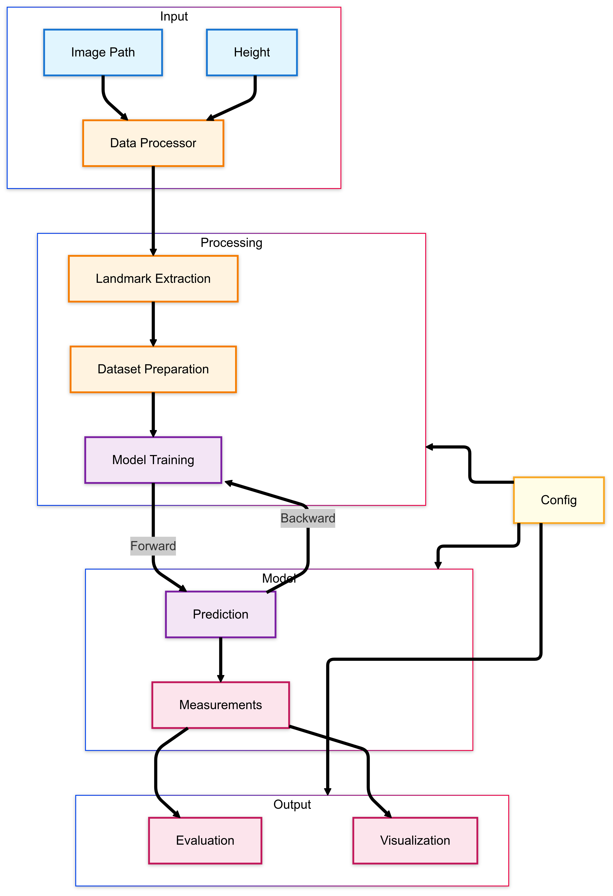
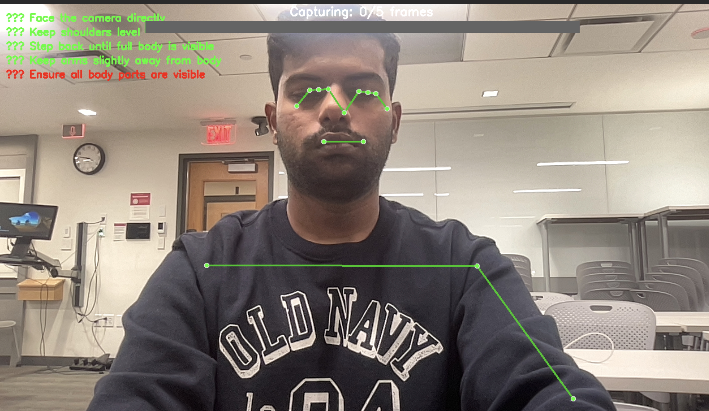
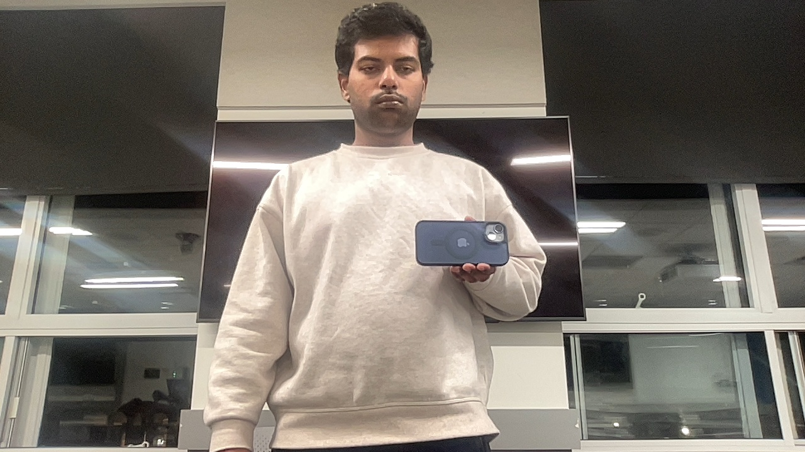
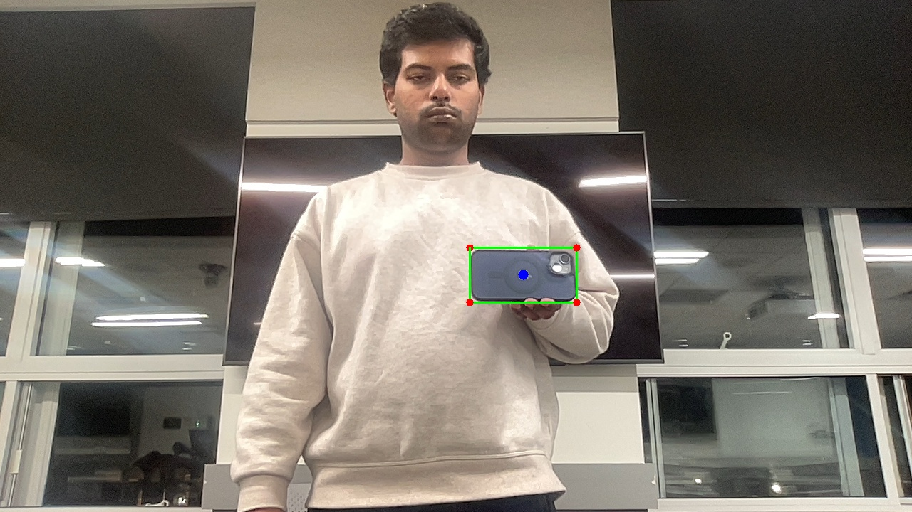
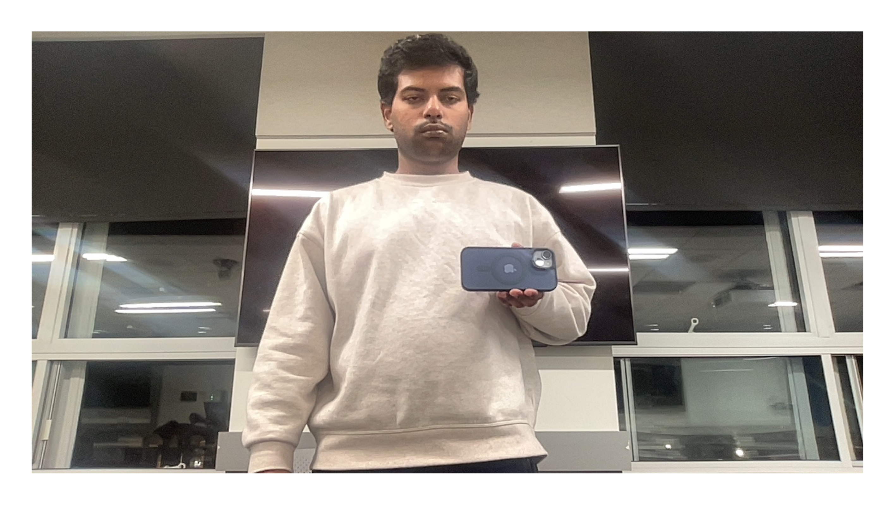

# Body Measurement Prediction System

This project implements a system for estimating key body measurements such as shoulder breadth and torso height from single images. It evaluates three distinct methods: the **Baseline Landmark-Based Method**, the **Geometric Method**, and the **Deep Learning (DL) Method**. The system is designed for applications like T-shirt size recommendations on e-commerce platforms.

## Features
- **Baseline Model**: Uses MediaPipe for pose landmark detection and basic calculations for measurements.
- **Geometric Model**: Enhances measurement accuracy using person and clothing segmentation, perspective correction, and scaling.
- **Deep Learning Model**: Employs neural networks to predict measurements, handling complex relationships between landmarks and body dimensions.

---
## Table of Contents
1. [Requirements](#requirements)
2. [Usage](#usage)
3. [Model Designs](#model-designs)
4. [Perspective Correction](#perspective-correction)
---

## Requirements

- Python 3.9.20
- numpy 1.26.4
- pandas 2.2.3
- matplotlib 3.9.2
- seaborn 0.13.2
- scikit-learn 1.5.2
- opencv-python 4.10.0.84
- mediapipe 0.10.18
- torch 2.2.2
- torchvision 0.17.2
- ultralytics 8.3.29
- transformers 4.47.0
- open3d 0.17.0
- pyglm 2.7.3
- pyglet 2.0.19

To install these dependencies with the specified versions, run:

```
pip install numpy==1.26.4 pandas==2.2.3 matplotlib==3.9.2 seaborn==0.13.2 scikit-learn==1.5.2 opencv-python==4.10.0.84 mediapipe==0.10.18 torch==2.2.2 torchvision==0.17.2 ultralytics==8.3.29 transformers==4.47.0 open3d==0.17.0 pyglm==2.7.3 pyglet==2.0.19
```

## Usage:

#### Run on Notebooks:
Refer the below 3 files to use our models.

1. use_BL.ipynb
2. use_DL.ipynb
3. use_GEO.ipynb


#### Using the bash script:
Trigger the bash script "run.sh" after activating the virtual environment (conda or python env).
---

## Model Designs:

### Baseline Model Design


### Geometric Model Design


### Deep Learning Model Design



## Perspective Correction:

#### Step 1:
We are guiding the user to ensure 5 points to get a perspective corrected image.


In the above image 5th check is failing because the complete body isn't visible in the camera.

#### Step 2:
We can also stand infront of the camera holding an iphone (currently support 13, 14, 15, 16)

<div style="background-color: black; color: white; padding: 20px;">

Original:
 

Debug:
 

Persepctive corrected:


</div>
We use a reference object to get the x, y, z rotational values. Then capture the images using the above application.

Note: We are not including this application in our cureent project code.

